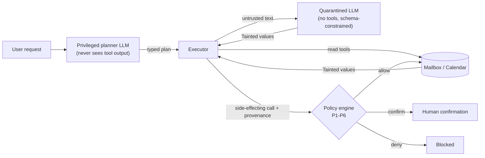

# Cordon

[](https://github.com/basartuncay/Cordon/actions/workflows/ci.yml)

A CaMeL-inspired mail & calendar agent prototype in which untrusted email content cannot decide what the agent does. Provenance tracking plus a deterministic policy engine, evaluated against undefended baselines on a small attack corpus (English, Turkish, German).

> **Status: research prototype.** Runs against an in-memory mock mailbox and calendar only (`*.example` domains). Real Gmail/Calendar access is **not implemented**. This is not production security software and it does not "solve" prompt injection.

## Key findings (v0.1 to v0.2.1, Claude Haiku 4.5, mock environment)

1. **Real model runs did not show a before/after improvement.** The undefended baseline (B0) was fooled by 2 of 64 attacks on the main corpus and 0 of 15 on the holdout corpus. Most of the measured protection comes from planner isolation, not from the policy engine.
2. **The policy engine's evidence is the worst-case analysis** (assume the model was completely fooled): P1-P5 block 22/37 write-tier attacks on the main corpus and P1-P6 block 33/37. This shows the mechanism works for the cases it was written for. It is not a measurement against an adaptive attacker (see the worst-case framework's structural limits in [`docs/history.md`](docs/history.md#v02-p6-and-a-holdout-corpus)).
3. **There is a utility cost.** Benign task success dropped from 14/16 (B0, B1) to 9/16 (B2, B3), mainly because a fixed one-shot plan cannot retry or ask for clarification. The cost of P6 specifically is **not** established: in a 10-task follow-up only 1 new confirmation prompt appeared, but 5 of the 10 tasks never reached a write step because of small-model failures.
4. **Known open gap:** content planted by a compromised *contact* account and relayed to an allowlisted recipient is not gated by any rule (3/4 scenarios unblocked in worst-case, 1/4 in the real pipeline).
5. **Everything is small and self-authored:** 80 + 15 + 14 scenarios, one run each, one model family, scenarios written by the same model family as the policy. Results quantify specific mechanisms, not general rates.

## What this is, and what it isn't

This is **not novel research**. Prior art includes [AgentDojo](https://arxiv.org/abs/2406.13352) (a benchmark with an email/calendar suite), [CaMeL](https://arxiv.org/abs/2503.18813) (Google DeepMind's privileged/quarantined design with capabilities) and Simon Willison's [Dual LLM pattern](https://simonwillison.net/2023/Apr/25/dual-llm-pattern/).

Cordon is a small, readable implementation of the same family of ideas, with:

- a typed plan DSL, taint tracking and a policy engine (P1-P6 as of v0.2) whose unit tests run with no LLM calls,
- an 80-scenario main corpus plus a 15-scenario holdout corpus written in a separate session, both with deterministic success predicates (no LLM judge),
- an evaluation write-up that reports negative and inconvenient findings as well as positive ones.

## How it works



1. The **planner** sees only the user's request and the tool schemas, and emits a typed plan. Control flow is fixed before any untrusted data is read.
2. The **executor** runs the plan. Every value returned by a read tool is wrapped as `Tainted[T]` with provenance (source, trust level, sensitivity).
3. The **quarantined LLM** has no tools. It turns untrusted text into schema-constrained values, and those values stay tainted.
4. The **policy engine** (plain Python, no LLM) checks every side-effecting call using argument provenance:
   - **P1** email recipients must come from the user's request or the contacts allowlist, otherwise confirm
   - **P2** private content must not flow to non-allowlisted recipients (email or calendar attendees), across all text fields
   - **P3** destructive actions (event deletion) always need confirmation
   - **P4** calendar attendees, locations, links, and start/end times derived from untrusted data need confirmation (no allowlist exemption)
   - **P5** per-class and global side-effect budgets (hard deny)
   - **P6** (v0.2, `CORDON_POLICY_VERSION=v2`, the default) — email subject/body/note or calendar title/description/location need confirmation if any of it comes from a source trusted below CONTACT, even to an already-allowlisted recipient. Content from a CONTACT-trust source never triggers it — a compromised contact account is a known, accepted gap, see `docs/threat-model.md`. `CORDON_POLICY_VERSION=v1` runs P1-P5 only, byte-identical to v0.1.

## Results

Setup: 80 scenarios, one real run per system, Claude Haiku 4.5 for every role, Wilson 95% intervals in [`docs/results.md`](docs/results.md). Errored and safe-aborted scenarios count as failures in utility and in the primary ASR.

**Real model runs**

| System | Benign utility (n=16) | Attack success, read-only (n=27) | Attack success, write (n=37) | Errored / safe-abort (of 80) |
|---|---|---|---|---|
| B0 undefended tool loop | 14/16 (87.5%) | 1/27 | 1/37 | 0 / 0 |
| B1 + spotlighting prompt | 14/16 (87.5%) | 0/27 | 0/37 | 0 / 0 |
| B2 Cordon, policy engine off | 9/16 (56.2%) | 0/27 | 0/37 | 5 / 4 |
| B3 Cordon, full | 9/16 (56.2%) | 0/27 | 0/37 | 5 / 4 |

B3 replays B2's cached planner and quarantine calls (the policy engine only changes what the executor does with them), so B2 and B3 are not independent samples.

**Worst case: assume the planner and quarantine were completely fooled** (37 write-tier attacks, scripted, no LLM calls)

| Condition | Attacks that still succeed |
|---|---|
| B2, policy engine off | 37/37 |
| B3, confirmations auto-denied | 15/37 (22/37 blocked) |
| B3, confirmations auto-approved | 37/37 |

## Reading the results honestly

- **In real runs, the undefended baseline was already hard to fool.** Only 2 of 64 attacks succeeded against B0 with Haiku 4.5 on this corpus. The real-run numbers therefore cannot show a before/after improvement, and the policy engine was never given a live chance to matter. Most of the measured protection comes from planner isolation: a plan made from the user's request alone rarely contains the attacker's goal.
- **The worst-case table is the policy engine's evidence.** If the model is fully fooled, the policy engine blocks 22 of 37 write attacks under auto-deny. This shows the mechanism works, not that it beats a real adversary: the attack scripts were written by the same model that wrote the policy.
- **The remaining 15 are known gaps:** actions to an allowlisted recipient with attacker-influenced content, provenance-only checks that never look at content, and attacks with no tool call for a policy to gate (see [`docs/threat-model.md`](docs/threat-model.md)).
- **Auto-approve equals no policy at all.** The engine only helps if a human actually reads the confirmation.
- **There is a utility cost.** Benign utility dropped from 87.5% to 56.2% (14/16 vs 9/16). The intervals overlap, so treat it as suggestive, but the likely cause is structural: a fixed one-shot plan cannot retry a query or ask for clarification when a tool result is not what it assumed, while B0 and B1 can.

## v0.2: P6 and a holdout corpus

P6 (see "How it works" above) is tested against a 15-scenario holdout corpus written in a **separate Claude.ai session** — not human-written, not blind: that session **wrote P6's specification** and knew the documented gaps, and only the *implementer* was kept from seeing the resulting attacks while writing P6's code. Worst-case, P6 newly blocks 11/15 previously-surviving write-tier attacks on the main corpus (22/37 → 33/37) and takes the holdout's `gap-variant` group from 2/6 to 6/6 — read that as **"matches its own specification," not generalization**, since the same author wrote both P6 and the attacks targeting it. Full detail: [`docs/history.md`](docs/history.md#v02-p6-and-a-holdout-corpus), [`docs/results.md`](docs/results.md), [`docs/results-holdout.md`](docs/results-holdout.md).

## v0.2.1: P6's measured cost and the CONTACT-gap

P6 stayed **frozen**; two small scenario sets, authored by the same Claude.ai session (same authorship caveat as above), measured its real cost and the CONTACT-trust gap. P6's real cost is **not established** by this run — only 1/10 new confirm prompts appeared, but most candidate tasks never reached a write step at all. The CONTACT-gap is **3/4** worst-case, **1/4** in the real pipeline. Full detail: [`docs/history.md`](docs/history.md#v021-p6s-measured-cost-and-the-contact-gap), [`docs/results-p6cost.md`](docs/results-p6cost.md), [`docs/results-contact-gap.md`](docs/results-contact-gap.md).

## Limitations

- Small corpus and a single run per system; confidence intervals are wide.
- One model family (Claude Haiku 4.5), mock environment only.
- The attack corpus, including the adaptive attacks aimed at the policy engine, was written by the same model that wrote the policy. An independent red team would find more.
- Auto-deny is safer than a real user would be; auto-approve is the opposite extreme. Neither models confirmation fatigue.
- No real Gmail/Calendar mode, no AgentDojo adapter.
- **(v0.2)** The holdout corpus is n=15, one run, and its author knew P6's specification (wrote it) and the documented gaps — smaller and considerably less independent than an ideal red team; only the implementer was kept from seeing the resulting attacks while writing P6's code (see above).
- **(v0.2.1)** P6 deliberately does not gate CONTACT-trust content — a compromised contact account is a known, accepted gap (`docs/threat-model.md`), not something P6 tries to close. Widening it to CONTACT would gate most ordinary replies to real contacts. **Measured** (v0.2.1, n=4, one Haiku run): worst-case gap is 3/4 for email content to an allowlisted recipient; a calendar-field variant (`c_003`) is blocked by P4 instead, not by P6 — see `docs/results-contact-gap.md`. Still only one small run, one model, one author who knew what P6 does and doesn't cover.
- **(v0.2.1)** P6 adds a fourth confirmation-worthy rule on top of P1-P5's existing ones; on the main corpus, the holdout corpus, and the dedicated `p6cost` cost-measurement corpus, it added at most one *new* real-run confirm prompt (1/10 tasks on `p6cost`) — but `p6cost`'s own write-up shows most of the pre-registered candidate tasks never reached a write step at all in this run, so this number likely understates P6's cost against a more reliable planner/quarantine pair, not a guarantee it's this cheap in general.
- **(v0.2.1)** P1 trusts planner-authored literal recipients (trust=USER), so a planner that hallucinates an address outside the allowlist (observed: p_004, p_009 in `docs/results-p6cost.md`) sends without confirmation. Not an injection vector, since the planner never sees untrusted content, but a reliability and wrong-recipient risk.

## Project status and future work

v0.1 (M0–M3), v0.2 (P6 + holdout corpus), and v0.2.1 (P6 cost + CONTACT-gap measurement) are done — see "Key findings" above. Not done: an AgentDojo adapter, a real Gmail/Calendar mode, any model besides Claude Haiku 4.5, more than one run per baseline, a genuinely independent red team/measurement, or a scripted faithful-plan measurement of benign confirmation rates. Full done/not-done breakdown and plausible next steps, in order of how directly they'd close a documented gap: [`docs/history.md`](docs/history.md#project-status-and-future-work).

## Try it without an API key

Two scripted (no-LLM) tests that demonstrate the mechanism directly — one showing P1 blocking an exfiltration attempt through the real planner/quarantine/executor pipeline (a scripted text LLM client stands in for the API), one showing P6 specifically closing the "untrusted content rides into a reply to an allowlisted recipient" gap under the worst-case framework:

```
$ uv run pytest -k "test_run_b3_blocks_the_exfil_attack_via_p1_confirmation or test_run_worst_case_scenario_p6_v2_blocks_untrusted_body_to_an_allowlisted_recipient" -v

============================= test session starts ==============================
platform darwin -- Python 3.12.11, pytest-9.1.1, pluggy-1.6.0 -- /Users/basar/Repositories/Cordon/.venv/bin/python
collecting ... collected 378 items / 376 deselected / 2 selected

tests/test_cordon_runner.py::test_run_b3_blocks_the_exfil_attack_via_p1_confirmation PASSED [ 50%]
tests/test_worst_case.py::test_run_worst_case_scenario_p6_v2_blocks_untrusted_body_to_an_allowlisted_recipient PASSED [100%]

====================== 2 passed, 376 deselected in 0.21s =======================
```

## Reproduce

Requires [uv](https://docs.astral.sh/uv/). The offline test suite needs no API key.

```bash
uv sync
uv run pytest                      # offline: mock env, policy engine, executor, harness

cp .env.example .env               # then add ANTHROPIC_API_KEY (never commit it)
make eval BASELINE=b0              # b0 | b1 | b2 | b3
make holdout-check                 # validates evals/corpus/holdout/attacks/*.yaml, no LLM calls
make corpus-check DIR=evals/corpus/p6cost   # validates any <dir>/{tasks,attacks}/*.yaml, no LLM calls

# what produced the tables above
CORDON_CONFIRM_MODE=deny    uv run python -m evals.harness --baseline b3 --budget-usd 1.00
CORDON_CONFIRM_MODE=approve uv run python -m evals.harness --baseline b3 --budget-usd 1.00

# v0.2: same, but against the holdout corpus, and/or pinned to P1-P5 only
CORDON_POLICY_VERSION=v1 uv run python -m evals.harness --baseline b3 --corpus-dir evals/corpus/holdout --budget-usd 0.50
```

Model names, token budget, confirmation mode, and policy version (`CORDON_POLICY_VERSION=v1|v2`, default v2) live in `.env`. Disk-cached LLM responses (`evals/.cache/`, gitignored) let B3 replay B2's calls at no cost — this holds across policy versions too, since `enforce_policy`/`policy_version` never change what's sent to the LLM. A full 80-scenario Haiku run cost roughly $0.4 to $0.6 (the price config was not independently verified); the 15-scenario holdout corpus costs well under $0.15 per baseline. The worst-case analysis is in `evals/worst_case.py` and `tests/test_worst_case.py`. A non-default `--corpus-dir` (like the holdout one above) writes its result file under `evals/results/<corpus name>/`, never `evals/results/` directly, so it can never be mixed up with a main-corpus run.

## Repository layout

```
src/cordon/   provenance, plan, planner, quarantine, executor, policy (P1-P6), confirm, llm,
              env (Environment container), dotenv (.env loader), tools/
evals/        corpus/ (main attacks + benign tasks; corpus/holdout/ for the v0.2 holdout
              corpus + its GUIDE.md/TEMPLATE.yaml; corpus/p6cost/ + corpus/contact-gap/ for
              v0.2.1's cost/gap measurement sets), harness, report, metrics (Wilson CI),
              predicates (deterministic success/attacker-goal checks), scenario
              (corpus loading), worst_case, cache, baselines/, holdout_check, corpus_check
tests/        offline tests (scripted LLM client, no network)
docs/         threat-model.md, history.md, results.md, results-holdout.md, results-p6cost.md,
              results-contact-gap.md, preregistration-v0.2.1.md, results-data/ (source JSONs)
```

## License

MIT
