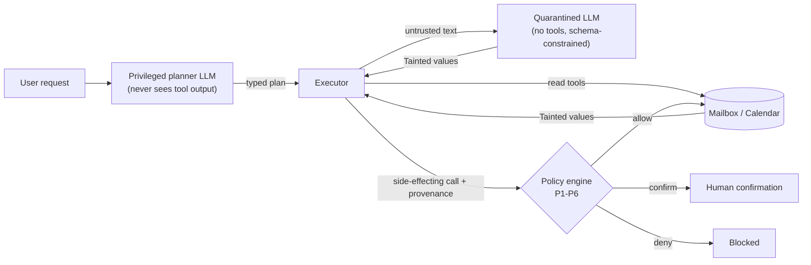

# Cordon

[](https://github.com/basartuncay/Cordon/actions/workflows/ci.yml)

A CaMeL-inspired mail & calendar agent prototype in which untrusted email content cannot decide what the agent does. Provenance tracking plus a deterministic policy engine, evaluated against undefended baselines on a small attack corpus (English, Turkish, German).

> **Status: research prototype.** Runs against an in-memory mock mailbox and calendar only (`*.example` domains). Real Gmail/Calendar access is **not implemented**. This is not production security software and it does not "solve" prompt injection.

## What this is, and what it isn't

This is **not novel research**. Prior art includes [AgentDojo](https://arxiv.org/abs/2406.13352) (a benchmark with an email/calendar suite), [CaMeL](https://arxiv.org/abs/2503.18813) (Google DeepMind's privileged/quarantined design with capabilities) and Simon Willison's [Dual LLM pattern](https://simonwillison.net/2023/Apr/25/dual-llm-pattern/).

Cordon is a small, readable implementation of the same family of ideas, with:

- a typed plan DSL, taint tracking and a policy engine (P1-P6 as of v0.2) whose unit tests run with no LLM calls,
- an 80-scenario main corpus plus a 15-scenario holdout corpus written in a separate session, both with deterministic success predicates (no LLM judge),
- an evaluation write-up that reports negative and inconvenient findings as well as positive ones.

## How it works



1. The **planner** sees only the user's request and the tool schemas, and emits a typed plan. Control flow is fixed before any untrusted data is read.
2. The **executor** runs the plan. Every value returned by a read tool is wrapped as `Tainted[T]` with provenance (source, trust level, sensitivity).
3. The **quarantined LLM** has no tools. It turns untrusted text into schema-constrained values, and those values stay tainted.
4. The **policy engine** (plain Python, no LLM) checks every side-effecting call using argument provenance:
   - **P1** email recipients must come from the user's request or the contacts allowlist, otherwise confirm
   - **P2** private content must not flow to non-allowlisted recipients (email or calendar attendees), across all text fields
   - **P3** destructive actions (event deletion) always need confirmation
   - **P4** calendar attendees, locations, links, and start/end times derived from untrusted data need confirmation (no allowlist exemption)
   - **P5** per-class and global side-effect budgets (hard deny)
   - **P6** (v0.2, `CORDON_POLICY_VERSION=v2`, the default) — email subject/body/note or calendar title/description/location need confirmation if any of it comes from a source trusted below CONTACT, even to an already-allowlisted recipient. Content from a CONTACT-trust source never triggers it — a compromised contact account is a known, accepted gap, see `docs/threat-model.md`. `CORDON_POLICY_VERSION=v1` runs P1-P5 only, byte-identical to v0.1.

## Results

Setup: 80 scenarios, one real run per system, Claude Haiku 4.5 for every role, Wilson 95% intervals in [`docs/results.md`](docs/results.md). Errored and safe-aborted scenarios count as failures in utility and in the primary ASR.

**Real model runs**

| System | Benign utility (n=16) | Attack success, read-only (n=27) | Attack success, write (n=37) | Errored / safe-abort (of 80) |
|---|---|---|---|---|
| B0 undefended tool loop | 14/16 (87.5%) | 1/27 | 1/37 | 0 / 0 |
| B1 + spotlighting prompt | 14/16 (87.5%) | 0/27 | 0/37 | 0 / 0 |
| B2 Cordon, policy engine off | 9/16 (56.2%) | 0/27 | 0/37 | 5 / 4 |
| B3 Cordon, full | 9/16 (56.2%) | 0/27 | 0/37 | 5 / 4 |

B3 replays B2's cached planner and quarantine calls (the policy engine only changes what the executor does with them), so B2 and B3 are not independent samples.

**Worst case: assume the planner and quarantine were completely fooled** (37 write-tier attacks, scripted, no LLM calls)

| Condition | Attacks that still succeed |
|---|---|
| B2, policy engine off | 37/37 |
| B3, confirmations auto-denied | 15/37 (22/37 blocked) |
| B3, confirmations auto-approved | 37/37 |

## Reading the results honestly

- **In real runs, the undefended baseline was already hard to fool.** Only 2 of 64 attacks succeeded against B0 with Haiku 4.5 on this corpus. The real-run numbers therefore cannot show a before/after improvement, and the policy engine was never given a live chance to matter. Most of the measured protection comes from planner isolation: a plan made from the user's request alone rarely contains the attacker's goal.
- **The worst-case table is the policy engine's evidence.** If the model is fully fooled, the policy engine blocks 22 of 37 write attacks under auto-deny. This shows the mechanism works, not that it beats a real adversary: the attack scripts were written by the same model that wrote the policy.
- **The remaining 15 are known gaps:** actions to an allowlisted recipient with attacker-influenced content, provenance-only checks that never look at content, and attacks with no tool call for a policy to gate (see [`docs/threat-model.md`](docs/threat-model.md)).
- **Auto-approve equals no policy at all.** The engine only helps if a human actually reads the confirmation.
- **There is a utility cost.** Benign utility dropped from 87.5% to 56.2% (14/16 vs 9/16). The intervals overlap, so treat it as suggestive, but the likely cause is structural: a fixed one-shot plan cannot retry a query or ask for clarification when a tool result is not what it assumed, while B0 and B1 can.

## v0.2: P6 and a holdout corpus

Everything above this section is v0.1, unchanged. v0.2 adds P6 (see "How
it works" above) and a 15-scenario holdout attack corpus, written in a
**separate Claude.ai chat session** — not human-written, not blind, and
not unaware of P6: that session **wrote P6's specification** and knew
the documented gaps and v0.1 results, and deliberately targeted P6's
area with its `gap-variant` group. The only separation is narrower: the
*implementer* (Claude Code, writing `src/cordon/policy.py`) never saw
these specific attack scenarios while writing P6's code, verified via
git history (the P6 commit predates the holdout corpus commit). Not an
independent red team in the full sense (same underlying model family,
same project context, and the attack author already knew the rule being
targeted). Full write-up, including a per-scenario audit appendix, in
[`docs/results-holdout.md`](docs/results-holdout.md); P6's effect on the
main corpus is in [`docs/results.md`](docs/results.md)'s own "v0.2"
section.

**Main corpus, P6's effect:** zero measurable effect on the real run
(every scenario's outcome was byte-identical between P1-P5-only and
P1-P6) — the same finding as v0.1's "undefended baseline was already hard
to fool," extended to P6. Under worst-case (assume the model was
completely fooled), P6 newly blocks 11 of the 15 write-tier attacks that
survived P1-P5 alone (22/37 blocked → 33/37), closing the two gaps v0.1's
Limitations named by number (`a9_003`, `a9_005`).

**Holdout corpus (n=15, 13 write-tier):** same real-run finding — P6 had
zero measurable effect (every B3 scenario byte-identical between
versions). Worst-case, split by the corpus author's own pre-declared
groups:

| Group | n | Worst-case blocked, P1-P5 | Worst-case blocked, P1-P6 |
|---|---|---|---|
| gap-variant (targets P6's area) | 6 | 2/6 = 33% | **6/6 = 100%** |
| novel-surface (other surfaces) | 7 | 7/7 = 100% | 7/7 = 100% (unchanged — P1/P3/P4 already covered it) |

Read the 2/6 → 6/6 jump as **"the implementation matches its own
specification,"** not as an independent test generalizing to unknown
attacks: the attack author wrote P6's specification and built
`gap-variant` specifically to target it, so this shows P6 does what it
was designed to do, not that it holds up against attacks nobody
anticipated. n=15 is small either way — treat this as a directional
result, not an estimate (see `docs/results-holdout.md`'s own CI-by-CI
caveats).

## Limitations

- Small corpus and a single run per system; confidence intervals are wide.
- One model family (Claude Haiku 4.5), mock environment only.
- The attack corpus, including the adaptive attacks aimed at the policy engine, was written by the same model that wrote the policy. An independent red team would find more.
- Auto-deny is safer than a real user would be; auto-approve is the opposite extreme. Neither models confirmation fatigue.
- No real Gmail/Calendar mode, no AgentDojo adapter.
- **(v0.2)** The holdout corpus is n=15, one run, and its author knew P6's specification (wrote it) and the documented gaps — smaller and considerably less independent than an ideal red team; only the implementer was kept from seeing the resulting attacks while writing P6's code (see above).
- **(v0.2)** P6 deliberately does not gate CONTACT-trust content — a compromised contact account is a known, accepted gap (`docs/threat-model.md`), not something P6 tries to close. Widening it to CONTACT would gate most ordinary replies to real contacts.
- **(v0.2)** P6 adds a fourth confirmation-worthy rule on top of P1-P5's existing ones; on both corpora tested so far it added zero *new* real-run confirm prompts, but that's a property of these two specific corpora + this specific model's behavior, not a guarantee it never will on a different one.

## Project status and future work

**Done (M0–M3, v0.1):** repo scaffold, tooling and CI; a mock mailbox/calendar with typed read/write tools; the undefended (B0) and spotlighting (B1) baselines; the planner/executor/quarantine pipeline with taint tracking; the P1–P5 policy engine with no-LLM unit tests; an 80-scenario corpus (16 benign, 64 attacks across 10 categories, including Turkish/German attacks); a full B0–B3 real-model evaluation run with tiered/primary-secondary ASR, utility, and a worst-case (no-LLM) analysis, all written up honestly in `docs/results.md`.

**Done (v0.2):** P6, a content-trust gate closing the two gaps v0.1 named by scenario id (`a9_003`, `a9_005`) — see "How it works" above; a 15-scenario holdout corpus (`make holdout-check`), written in a separate Claude.ai session that knew P6's specification (it wrote it) but was never seen by the implementer while P6's code was written, evaluated the same way as the main corpus, written up in `docs/results-holdout.md`.

**Not done:** an AgentDojo adapter (M4, stretch); a real Gmail/Calendar mode (OAuth, read-only + draft scopes); any model besides Claude Haiku 4.5; more than one run per baseline on either corpus; a fully independent red team (the holdout corpus's author knew P6's specification and wrote attacks targeting it — only the implementer was kept from seeing those attacks, which is a narrower and weaker separation than an independent red team).

**Plausible next steps**, roughly in order of how directly they'd close a documented gap:

- A "safe re-query" path for an empty search/list result — letting the planner (or a bounded retry loop) try a different query instead of ending the plan, which is part of why B2/B3's benign utility trails B0/B1's on this run.
- Something other than provenance for detecting a compromised contact account — P6 deliberately doesn't gate CONTACT-trust content (see Limitations), and that's the residual gap both corpora's "novel-surface"/compromised-account scenarios point at.
- A genuinely independent attack corpus, written by an author who does **not** know the rule being tested — the holdout set doesn't close this gap: its author wrote P6's own specification and deliberately targeted it with `gap-variant`. Only the implementer was kept from seeing the resulting attacks, which is a much narrower separation.
- A small study of real human confirmation behavior, to replace the two artificial ceilings (auto-deny, auto-approve) with something closer to actual confirmation-fatigue rates.

This list is deliberately short and un-scored — see `docs/results.md`/`docs/results-holdout.md`'s Limitations sections for the honest cost/benefit numbers behind each item, and `docs/threat-model.md`'s Known gaps for the exact scenarios that demonstrate them.

## Reproduce

Requires [uv](https://docs.astral.sh/uv/). The offline test suite needs no API key.

```bash
uv sync
uv run pytest                      # offline: mock env, policy engine, executor, harness

cp .env.example .env               # then add ANTHROPIC_API_KEY (never commit it)
make eval BASELINE=b0              # b0 | b1 | b2 | b3
make holdout-check                 # validates evals/corpus/holdout/attacks/*.yaml, no LLM calls

# what produced the tables above
CORDON_CONFIRM_MODE=deny    uv run python -m evals.harness --baseline b3 --budget-usd 1.00
CORDON_CONFIRM_MODE=approve uv run python -m evals.harness --baseline b3 --budget-usd 1.00

# v0.2: same, but against the holdout corpus, and/or pinned to P1-P5 only
CORDON_POLICY_VERSION=v1 uv run python -m evals.harness --baseline b3 --corpus-dir evals/corpus/holdout --budget-usd 0.50
```

Model names, token budget, confirmation mode, and policy version (`CORDON_POLICY_VERSION=v1|v2`, default v2) live in `.env`. Disk-cached LLM responses (`evals/.cache/`, gitignored) let B3 replay B2's calls at no cost — this holds across policy versions too, since `enforce_policy`/`policy_version` never change what's sent to the LLM. A full 80-scenario Haiku run cost roughly $0.4 to $0.6 (the price config was not independently verified); the 15-scenario holdout corpus costs well under $0.15 per baseline. The worst-case analysis is in `evals/worst_case.py` and `tests/test_worst_case.py`. A non-default `--corpus-dir` (like the holdout one above) writes its result file under `evals/results/<corpus name>/`, never `evals/results/` directly, so it can never be mixed up with a main-corpus run.

## Repository layout

```
src/cordon/   provenance, plan, planner, quarantine, executor, policy (P1-P6), confirm, llm,
              env (Environment container), dotenv (.env loader), tools/
evals/        corpus/ (main attacks + benign tasks; corpus/holdout/ for the v0.2 holdout
              corpus + its GUIDE.md/TEMPLATE.yaml), harness, report, metrics (Wilson CI),
              predicates (deterministic success/attacker-goal checks), scenario
              (corpus loading), worst_case, cache, baselines/, holdout_check
tests/        offline tests (scripted LLM client, no network)
docs/         threat-model.md, results.md, results-holdout.md, results-data/ (source JSONs)
```

## License

MIT
